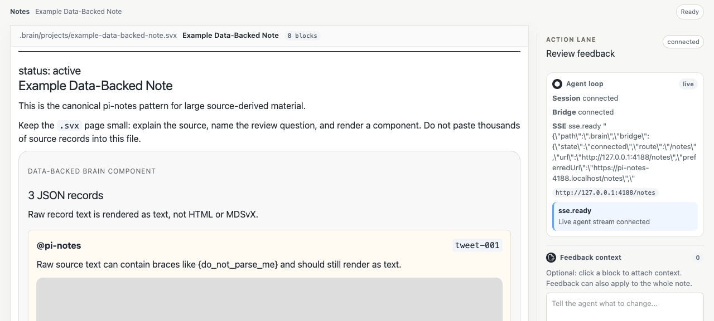
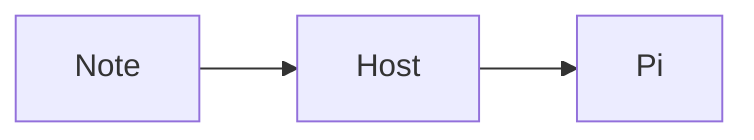

# 🧠 pi-notes

**A Pi extension for local Brain review pages, data-backed notes, and browser-to-agent feedback.**

[](LICENSE)
[](https://github.com/earendil-works/pi)

pi-notes turns a repo-local `.brain/` folder into readable review pages at `/notes`. The browser is for reading, selecting, and commenting. Pi still owns the source edits and leaves receipts.



It is not Obsidian in a trench coat. It is a local review surface wired to the agent session that opened it.

## Why

Long-running agent work needs better artifacts than chat exhaust.

- `.svx` Brain pages keep project memory small, linked, and reviewable.
- `.brain/data/**` keeps giant source-derived dumps out of MDSvX.
- `.brain/components/**` lets projects render rich local review pages without forking pi-notes.
- Browser feedback comes back to the active Pi session as a Review Batch.

## What You Get

| Piece | What it does |
| --- | --- |
| Pi extension | Adds `/notes`, starts the local Document Host, binds feedback to the current Pi session |
| Document Host | SvelteKit/mdsvex app that renders `.brain/**/*.svx` at `/notes` |
| Review Surface | Select blocks, write comments, queue feedback, send batches back to Pi |
| Brain scaffold | Creates `BRAIN.md` and `.brain/` on first awakening when missing |
| Updatable templates | `pi-notes rig install|update` applies the default Brain scaffold and managed harness instruction blocks |
| Data-backed notes | Canonical `.brain/data/**` + `.brain/components/**` pattern for large JSON/source material |
| Standard Brain components | shadcn-like MDSvX component base: callouts, status, source refs, review receipts, diagram frames |
| Brain component composition skill | Agent skill for designing reusable MDSvX components, data contracts, and project Brain component libraries |
| Diagram compiler | Tiny DAG DSL that compiles to Excalidraw previews |
| Mermaid rendering | Fenced `mermaid` blocks render to tldraw-style light/dark SVGs |
| CLI | `pi-notes brain check`, `pi-notes rig install`, `pi-notes inbox`, `pi-notes diagram compile`, `pi-notes mermaid render` |

## Install

| Mode | Command |
| --- | --- |
| Project install | `pi install -l git:github.com/joelhooks/pi-notes` |
| Global install | `pi install git:github.com/joelhooks/pi-notes` |
| One-off run | `pi -e git:github.com/joelhooks/pi-notes` |
| HTTPS fallback | `pi install https://github.com/joelhooks/pi-notes` |
| Local checkout | `pi install -l ./pi-notes` |

Project installs write to the current repo's `.pi/settings.json`. You can also add the package explicitly:

```json
{
  "packages": ["git:github.com/joelhooks/pi-notes"]
}
```

After installing or changing package refs, run `/reload` in Pi.

## Commands

### Pi slash commands

| Command | What it does |
| --- | --- |
| `/notes` | Open the local notes surface |
| `/notes status` | Show Document Host and bridge state |
| `/notes connect` | Repair/rebind the current session bridge |
| `/notes open` | Open the local notes URL |
| `/notes inbox` | Read the latest saved Review Batch |
| `/notes check` | Validate the local Brain scaffold |

Normal use should not require `/notes connect`; the extension auto-connects on session start.

### CLI

```bash
pi-notes brain check
pi-notes rig install /path/to/repo
pi-notes rig update /path/to/repo
pi-notes inbox
pi-notes diagram compile docs/diagrams/example.diagram
pi-notes mermaid render
```

## How It Works

```txt
Pi session
  ├─ pi-notes extension
  │   ├─ initializes BRAIN.md and .brain/ when missing
  │   ├─ starts the local Document Host on a free loopback port
  │   └─ starts a session bridge for Review Batches
  └─ browser at /notes
      ├─ renders .brain/**/*.svx through mdsvex/Svelte
      ├─ lazy project components can read .brain/data/**
      └─ sends selected feedback back to the spawning Pi session
```

Package resources are advertised with the `pi` key:

```json
{
  "pi": {
    "extensions": ["./extensions/pi-notes/index.ts"],
    "skills": ["./skills"]
  }
}
```

The package uses an explicit `files` list so npm/git installs do not ship local receipts, `.pi/notes-*` scratch state, reference repos, or this repo's private `.brain/` content.

Check the payload:

```bash
npm pack --dry-run --json
```

## Brain Pages

Brain entries are `.svx` files under `.brain/`:

```txt
.brain/projects/my-project.svx
.brain/areas/my-area.svx
.brain/resources/my-reference.svx
.brain/archives/old-thing.svx
```

Each file becomes a route:

```txt
/notes/projects/my-project
/notes/areas/my-area
/notes/resources/my-reference
```

Project entries can include a status:

```svx
---
status: active
---

# My Project
```

Allowed statuses: `active`, `queued`, `blocked`, `paused`, `done`, `archived`.

## Data-Backed Brain Notes

Use `.brain/data/` for large JSON-backed source material. Use `.brain/components/` for renderers. Keep `.svx` as the narrative shell, not the database. Agents should load the bundled `brain-component-composition` skill before substantial `.svx`, `.brain/data`, or `.brain/components` work.

Canonical shape:

```txt
.brain/projects/tweet-wall.svx
.brain/data/tweet-wall.json
.brain/components/TweetWall.svelte
```

Tiny `.svx` shell:

```svx
# Tweet Wall

This note reviews a large source-backed tweet archive without inlining it into MDSvX.

<TweetWall />
```

Project-local components in `.brain/components/**/*.svelte` are auto-imported by tag name. If the page already imports a component, pi-notes does not add a duplicate import. Components can import JSON from `.brain/data/**` with normal relative imports:

```svelte
<script lang="ts">
  import records from "../data/tweet-wall.json";
</script>
```

Performance rules:

- paginate or virtualize large lists
- lazy-load images and embeds near scroll/intersection
- use `preload="none"` for videos
- render raw source text with Svelte text interpolation like `{record.text}`, never `{@html record.text}`
- do not paste raw JSON/tweets/media dumps into `.svx`; raw `{}` source text can break MDSvX parsing

The Brain checker accepts:

```txt
.brain/**/*.svx
.brain/data/**
.brain/components/**/*.svelte
.brain/*.config.ts
.brain/*.config.js
```

See `examples/brain-data-backed-note/` and this repo's dogfood page at `.brain/projects/example-data-backed-note.svx`.

Standard components auto-import by tag name: `NoteCallout`, `StatusPill`, `SourceReference`, `ReviewReceipt`, `DiagramFrame`, plus review/support helpers. Project components with the same tag name override package defaults.

For a reusable provider plus child component scaffold, see `examples/brain-provider-variant-surface/`. It includes `BrainDataProvider`, `BrainSummaryCard`, `BrainReceiptList`, and explicit receipt variants. Use that shape when a Brain surface needs shared data, local UI actions, provenance metadata, and multiple workflow states.

## Feedback Loop

The browser sends a Review Batch to the same-origin SvelteKit API. Do not POST from the browser directly to `127.0.0.1`; HTTPS, tailnet, and phone browsers make that brittle. The Document Host saves an ingress receipt, forwards the batch server-side to the extension bridge, and the bridge sends it into the current Pi session as a user turn.

Receipts and traces live under ignored local state:

```txt
.pi/notes-inbox/
.pi/notes-bridge/events.jsonl
.pi/notes-bridge/receipts/
```

A successful browser POST means delivery to Pi. A handled batch should also get a session-written receipt.

## Diagrams

Author tiny DAG diagrams in:

```txt
docs/diagrams/*.diagram
```

Compile them to Excalidraw artifacts:

```bash
pi-notes diagram compile docs/diagrams/pi-notes-feedback-loop.diagram
```

Reference either artifact from a Brain page with a fenced single-path block:

````md
```txt
docs/diagrams/pi-notes-feedback-loop.diagram
```
````

The note renderer previews the existing artifact and shows stale/missing warnings. Page render does not mutate files.

Fenced Mermaid blocks render through a tldraw/Playwright harness into workspace-local SVGs:

````md

````

Generated SVGs live in ignored local cache `.pi/notes-cache/diagrams/` and are served at `/diagrams/{hash}.svg`. Dev/build render them automatically; to render manually:

```bash
pi-notes mermaid render
pi-notes mermaid clean
```

Fresh machines may need one Playwright browser install first:

```bash
bunx playwright install chromium
```

## Templates and harness instructions

The default project scaffold lives in `templates/default/`. It installs missing Brain pages and appends managed instruction blocks to `AGENTS.md`, `CLAUDE.md`, and `.pi/APPEND_SYSTEM.md`.

```bash
pi-notes rig install /path/to/repo # create missing scaffold, preserve local files
pi-notes rig update /path/to/repo  # refresh managed pi-notes instruction blocks
```

`rig update` does not overwrite project-owned `.brain` pages or local components. It only refreshes managed instruction blocks and creates missing defaults.

Codex package coverage lives in `.codex-plugin/` and `hooks/`; Pi coverage lives in `extensions/pi-notes/`; Claude/Codex repo-file coverage comes from the managed template blocks.

## Development

```bash
bun install
bun run check
bun run brain:check
bun run build
npm pack --dry-run --json
```

Run the Document Host directly:

```bash
bun run dev
```

The extension normally starts the host itself with a free `PI_NOTES_PORT`.

## Limitations

- pi-notes is Pi-first. Other harnesses can read the files, but the bridge behavior is Pi-specific.
- The Document Host is local-only; it is not a public publishing service.
- Project-local Svelte components execute as local code. Review them like any other repo code.
- RPC mode may become the future transport, but the current bridge is intentionally in-process so feedback targets the spawning session.

## License

MIT
